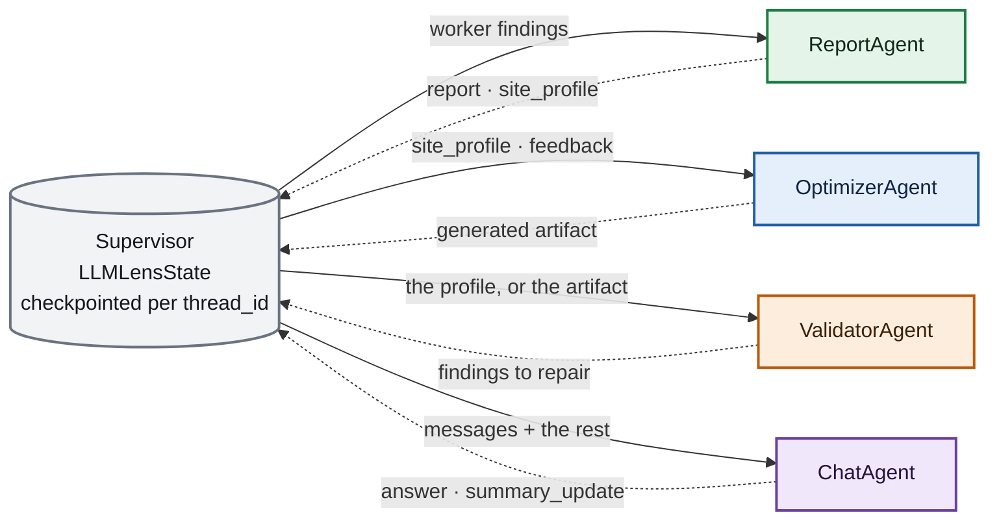
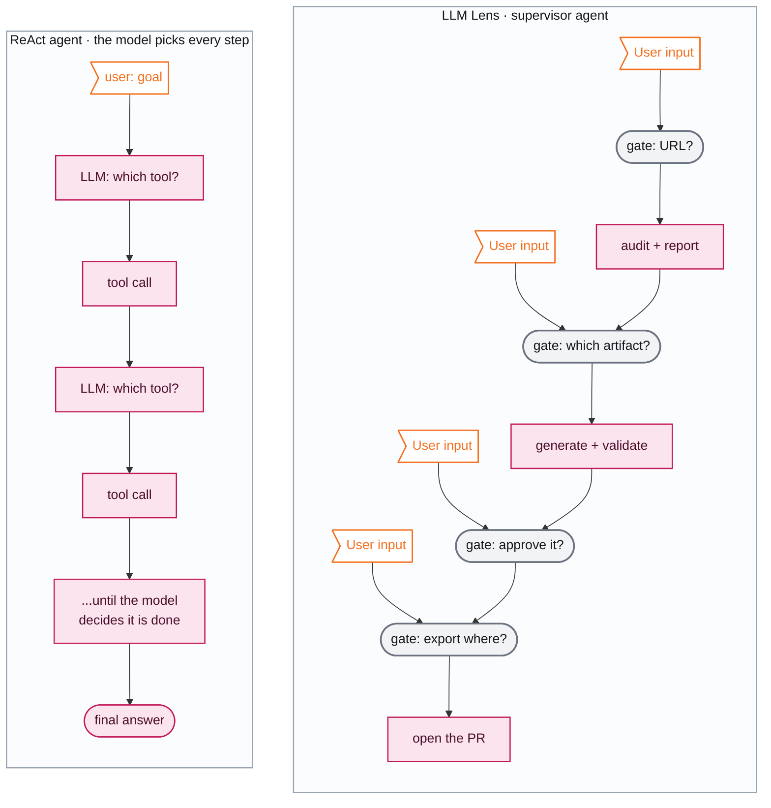
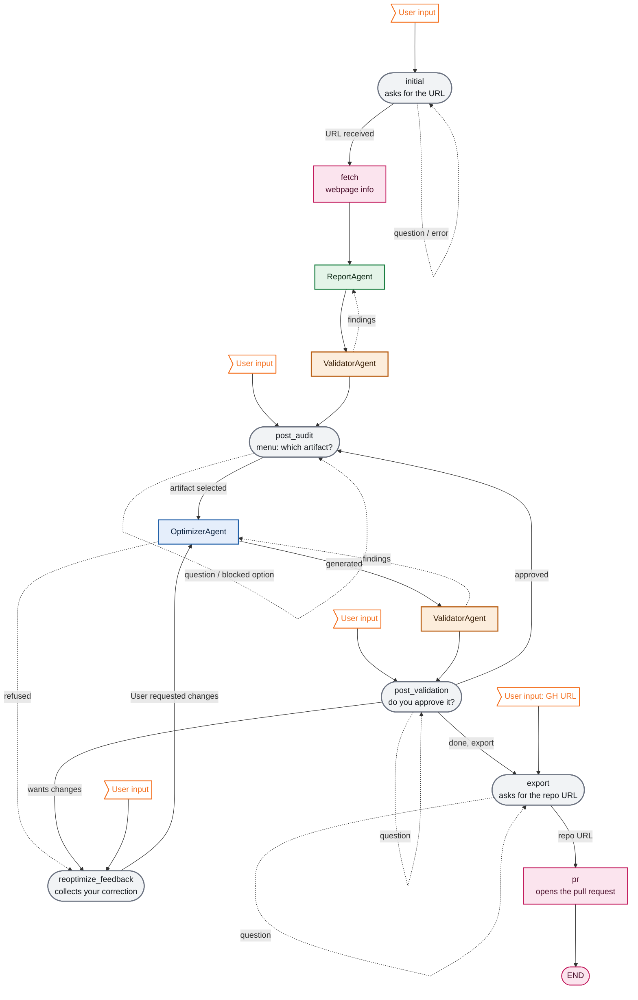
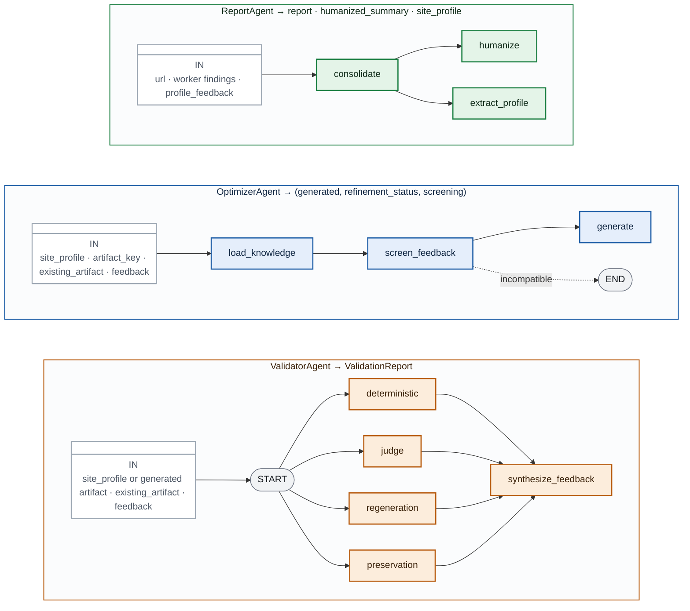

# Anatomy of LLM Lens

## Supervisor and Subagents Architecture

LLM Lens is a **supervisor–subagent architecture**. One LangGraph graph, the supervisor (`LLMLensAgent`), owns the flow and owns the state. Four subagents do the specialised work: **ReportAgent**, **OptimizerAgent**, **ValidatorAgent** and **ChatAgent**.

The subagents never call each other. They cooperate through a single shared state, the supervisor's `LLMLensState`, checkpointed per `thread_id`: a supervisor node reads what a subagent needs from the state, calls it, and writes what comes back. The next subagent's node picks it up from there.

> **Legend**
> - 🟩 **ReportAgent** · 🟦 **OptimizerAgent** · 🟧 **ValidatorAgent** · 🟪 **ChatAgent** · ⬜ the supervisor and its state
> - **Arrows**, ➡️ solid is what the calling node passes in · ⇢ dotted is what the subagent returns, which the *node* then writes

That last distinction is how one subagent's output becomes another's input without either knowing the other exists:

| Subagent | Reads (via its node) | Returns (the node writes it) | Picked up by |
|---|---|---|---|
| **ReportAgent** | worker findings, `site_profile_feedback` | `report`, `humanized_summary`, `site_profile` | ValidatorAgent, OptimizerAgent, ChatAgent |
| **ValidatorAgent** | `site_profile`, or the generated artifact | `site_profile_feedback` / `validation_feedback`, `validation_results` | ReportAgent or OptimizerAgent |
| **OptimizerAgent** | `site_profile`, findings, `user_feedback`, `validation_feedback` | `generated_artifacts` | ValidatorAgent, ChatAgent, export node |
| **ChatAgent** | `messages` and the rest of the state | the answer and a `summary_update` | the gate that called it |

---

## Why it stops: ReAct agent versus supervisor agent

The default shape for an agent today is the **ReAct loop**: the model gets a goal and a set of tools, and on every iteration it decides which tool to call next, until it decides it is done. Control flow *is* the model's output. The human speaks at the start and reads at the end.

LLM Lens is a **supervisor agent**: one graph that owns the itinerary, four subagents that do the specialised work, and `interrupt()` at five points where the state is persisted and a person decides.

This is not a smaller kind of agent. The model still drives, reading intent, writing the report, extracting the site profile, generating each artifact, grading it and answering questions about it. What it does not do is choose which phase comes next. Autonomy sits *inside* each phase rather than in the routing between them.

> **Legend**
> - ⬜ oval **Gate** :  the graph calls `interrupt()`, persists the state and waits for a person, and the oval shape sets it apart from a machine step
> - 🩷 box **Machine step** :  runs to completion with nobody watching
> - 👤 **User input** :  where a person types and the graph resumes; `user: goal` on the ReAct side plays the same role

| | ReAct agent | LLM Lens · supervisor agent |
|---|---|---|
| **Who picks the next step** | The model, every iteration | The graph's edges. The model only maps the user's text onto the gate's fixed set of actions |
| **Where the human is** | At the start and the end | At every decision with consequences: which artifact, whether to approve it, where to export it |
| **Loops** | Open until the model stops or a budget runs out | Each one capped: 1 repair pass, 1 re-optimization per artifact, 25 chat turns |
| **When it goes wrong** | Drifts, repeats tools, acts on a misread goal | Stops and asks |
| **Cost and latency** | Hard to predict | Bounded per phase |
| **Fits** | Open-ended exploration | A known procedure whose output lands in someone else's repo |

What it gives up is flexibility: at a given gate you can ask questions or pick from the menu, but you cannot send the agent off to do something the graph has no edge for. For a tool that ends by opening a pull request, that is the trade we want.

---

## Three kinds of piece: gates, nodes, subagents

Every step of the supervisor graph ( everything drawn as a box in the diagrams above and below) is one of three kinds. Most confusion about the flow comes from lumping them together. They are different things, and **only one of the three can touch the state**.

| Kind | Count | What it is |
|---|---|---|
| **Gate** | 5 | Calls `interrupt()`. The graph stops there and the user types. It is a node, so it does write to the state. |
| **Node** | 6 | Runs without intervention, returns a state *update*, and hands the turn back to the router. Also a node: it writes. |
| **Subagent** | 4 | An object a node instantiates and calls. Returns domain data. **Never touches the state, the node handles the LLMLens State update** |

---

## A session, end to end

The whole session, with every loop the graph actually has.

> **Legend**
> - ⬜ oval **Gate**, where the user is sitting and waiting; the oval shape marks the five `interrupt()` points
> - 🩷 box **Node**, a step with no subagent behind it (`fetch`, `pr`)
> - 🟩 **ReportAgent** · 🟦 **OptimizerAgent** · 🟧 **ValidatorAgent**, every other box is named for the subagent it calls; **ValidatorAgent** appears twice, once for the site profile (`validate_profile`) and once for the generated artifact (`invoke_validator`)
> - 👤 **User input**, what you typed, arriving at that gate
> - ➡️ solid is the happy path · ⇢ dotted is a loop back, and every one of them is capped

Four things worth reading off the diagram:

- **Every gate routes questions back to itself.** Asking a question never advances the session, and you come back out standing exactly where you were. That loop is capped at `MAX_CHAT_TURNS = 25` per session, counted globally rather than per gate, because it is the same loop wherever the user happens to be standing.
- **Both repair loops are one-shot** (`MAX_PROFILE_REGENERATIONS` and `MAX_ARTIFACT_REGENERATIONS`, both `1`). The repair pass regenerates from an identical `SiteProfile`, so whatever survived the first correction is unlikely to fall to a third. When the cap is hit, the remaining findings are surfaced and the session moves on.
- **The optimizer has an early exit.** If screening refuses the user's request as incompatible with the spec, nothing was regenerated, so routing on to the validator would grade the *previous* version again and report it as fine. The user goes back to rephrase instead.
- **`reoptimize_feedback` is reached two different ways, for two different reasons.** From `invoke_optimizer` (`refused`), it means screening rejected the request before generating anything, and you are asked to rephrase. From `post_validation` (`wants changes`), it means the artifact passed validation and you chose not to approve it, and you are asked what to change. Same node, same next step (back to `invoke_optimizer`), but a different artifact version behind each one.

Export is reachable only from `post_validation`, not from the artifact menu: you export after approving something, not instead of generating it.

## Inside each subagent

Each one has its own compiled graph, invisible from the supervisor. What comes out of `run()` is domain data that the calling node decides how to use.

> **Legend**
> - 🟩 **ReportAgent** · 🟦 **OptimizerAgent** · 🟧 **ValidatorAgent**, every box here is a node of that subagent's *own* compiled graph
> - ⬜ **IN** (divided-process shape), the arguments the calling node passes to `.run()`; **START**/**END** belong to the subgraph, not to the supervisor
>
> Nothing in this picture can write to `LLMLensState`.

**ReportAgent** consolidates the findings and then, in parallel, writes the narrative and extracts the site profile. On a validator re-run it skips `humanize`: the narrative came from findings that have not changed. Its own document: [report-agent.md](./report-agent.md).

**OptimizerAgent** screens *before* generating. A request that clashes with the artifact's specification is refused and costs no more than that one call, which is what the early exit is for. Its own document: [optimizer-agent.md](./optimizer-agent.md).

**ValidatorAgent** fans four independent checks out from the start and has one junction that waits for all four before writing the verdict: `deterministic` (spec rules), `judge` (LLM grading), `regeneration` (did the repair actually fix it), and `preservation` (did it silently drop what the user asked for). Only ERROR-severity checks become feedback that loops, because warnings about known pipeline limits, like sparse HTML, would otherwise loop to the cap every single time. Its own document: [validator-agent.md](./validator-agent.md).

**ChatAgent** is a single node with two model calls and a no-model selection in between. It is the only subagent that reads `messages`, and it has its own document: [chat-agent.md](./chat-agent.md).

How each gate classifies what you typed and where the router sends the session next has its own document too: [supervisor.md](./supervisor.md).

Two artifacts, `robots.txt` and the WebMCP manifest, are assembled deterministically from findings, so there is no model output to grade. They get a placeholder validation and pass regardless.
