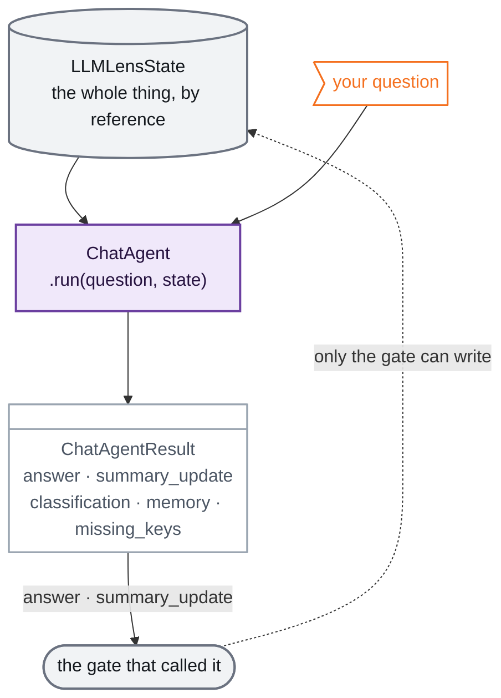
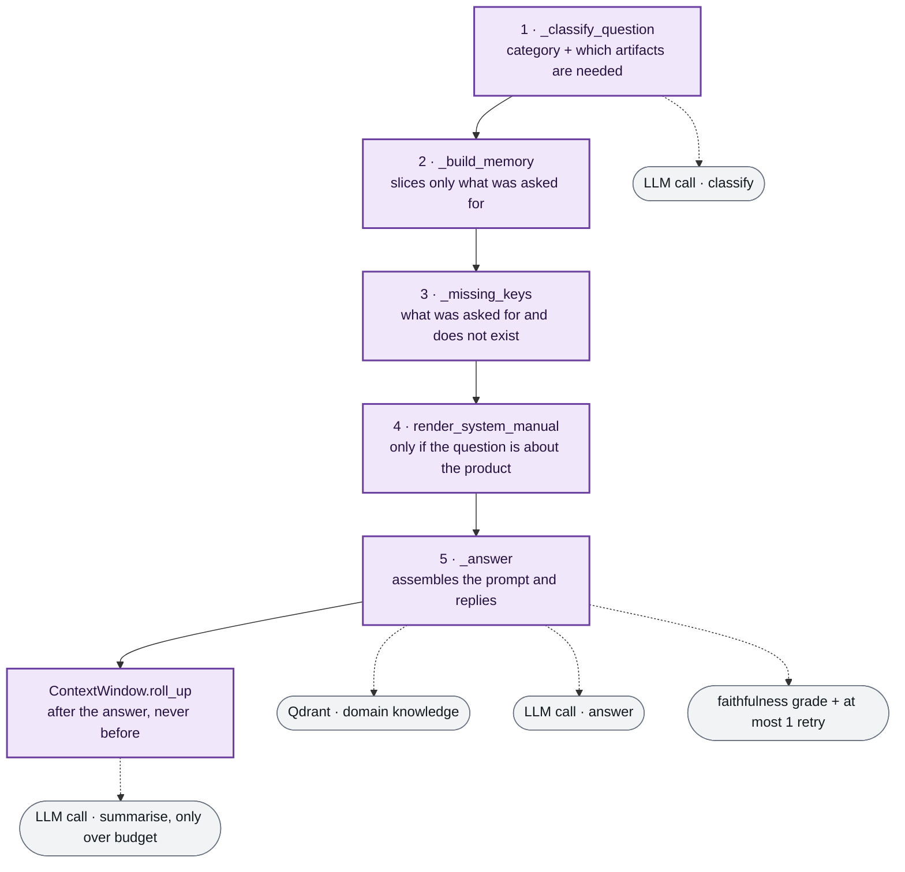

# The ChatAgent, from the inside

The ChatAgent answers the user's questions at every gate of the [session graph](./architecture.md#a-session-end-to-end). It is a subagent, not a node, which is the constraint everything else here follows from.

Source: [`src/agents/subagents/chat_agent/`](../src/agents/subagents/chat_agent/).

---

## 1. The five kinds of question

Everything the ChatAgent does is downstream of one decision: **what kind of question is this?** Nothing else about the run changes, so this is the place to start.

| Category | What the user is really asking | Example |
|---|---|---|
| `conceptual` | about the idea itself, not about their site | "what is llms.txt?" |
| `about_audit` | whether what the audit found is good or bad | "are my meta tags any good?" |
| `about_artifacts` | about a file: the one their site serves, or the one we wrote | "why did you create llms.txt like this?" |
| `about_validation` | about the quality gate's verdict | "why did validation reject it?" |
| `about_system` | about LLM Lens itself, not about their site | "why can't I generate the mcp.json?" |

The category is only half of what the classifier returns. The full answer is three fields:

```python
class QuestionClassification(BaseModel):
    category: Literal["conceptual", "about_artifacts", "about_audit",
                      "about_validation", "about_system"]
    needs_artifact_keys: list[str] = []
    references_current_artifact: bool = False
```

`needs_artifact_keys` is which files the question touches (`llms_txt`, `meta_tags`, …). `references_current_artifact` is the "this" detector: it fires when the user says *"is **this** any good?"* without naming a file, and when it does, it **replaces** the key list with whatever is in `selected_artifact` rather than adding to it.

> **Three of the five categories are the same route.** `about_artifacts`, `about_audit` and `about_validation` run identical code: same steps, same keys, same prompt. The category name changes nothing about the machinery, only what the classifier puts in `needs_artifact_keys`. The two genuinely different routes are the extremes, `conceptual` (withholds the file bodies) and `about_system` (swaps the knowledge source).


---

## 2. What goes in, and what comes back

The gate does not hand the agent messages. It hands it **the entire state** with `run(question, state)`, and the ChatAgent helps itself to the keys it needs.



> **Legend**
> - 🟪 the **ChatAgent** itself
> - ⬜ the supervisor's state and the gate that owns the turn
> - 👤 your question, which arrives as a parameter, not through the state

Two of the five result fields are consumed by the caller. `answer` becomes the reply the gate appends to `messages`. `summary_update` is the `LLMLensState` fragment (`context_summary` and `context_summary_upto`) that the gate merges into its own update, and it is `None` on the turns that changed neither, which is most of them. The other three are computed and discarded; they exist for tracing and tests.

**The agent cannot write either of them itself.** It is not a node of the supervisor graph, so it has no update to return. Everything it produces reaches the state through the gate that called it.

### The order matters

The gate calls the ChatAgent *before* returning its update. When the agent reads `state["messages"]`, the question you are currently asking **is not in there yet**, it arrives separately through the `question` parameter. The history it sees is always the one from before your turn.

---

## 3. Which state key enters where

The work happens in five steps inside a single node. Named here so the table below can point at them, and expanded in the next section:

1. `_classify_question` · 2. `_build_memory` · 3. `_missing_keys` · 4. `render_system_manual` · 5. `_answer`

Step 1 reads **nothing** from the state; it sees only your question. Step 3 reads only what steps 1 and 2 produced. So every state key below enters at step 2, except the one that enters at step 4.

| State key | What it is for | Enters at | When |
|---|---|---|---|
| `url` | Anchors the answer to the audited site. And by its *absence*: with no URL yet, an instruction is injected to end by asking for one. | 2 | always |
| `humanized_summary` | Lets it answer about what the audit found without re-reading the raw findings. | 2 | always |
| `humanized_details` | The report's own paragraph on each dimension the question touches. Without it the agent gets the raw `<head>` and nothing else, and has to re-grade the page itself. | 2 | dimensions of the requested keys |
| `discoverability_findings` · `geo_findings` | The parsed verdict behind that paragraph, which properties were actually assessed. This is the half that stops the model inventing requirements the audit never checks. | 2 | keys the question touches |
| `existing_artifacts` | The literal content the site serves today, which is the only thing that can support a judgement about whether it is any good. | 2 | only the keys the classifier asked for |
| `generated_artifacts` | The version we wrote. It travels next to the served one under a different label, so the two can be compared without being confused. | 2, 4 | only the keys the classifier asked for |
| `validation_results` | The quality gate's verdict, whether it passed and what it found. | 2 | only the keys the classifier asked for |
| `artifact_scans` | Prompt-injection risk per artifact. A hostile file's *content* is withheld from the prompt; the fact that it exists and why is not. | 2 | keys the question touches |
| `selected_artifact` | Resolves "this" when the user asks without naming the file. When it fires it *replaces* the key list rather than adding to it. | 2 | only if `references_current_artifact` |
| `messages` | Continuity: understanding a question that leans on the previous one. Everything after the summary watermark, verbatim. | 2 | always |
| `context_summary` · `context_summary_upto` | What came before that watermark, compressed, and the watermark itself. | 2 | always |
| `webmcp_findings` | Not audit data any more. It reaches the prompt through `render_system_manual(parent_state)`, which draws the live menu for *this* run, including which options came out blocked. | 4 | only `about_system` |

---

## 4. One node, five steps

The ChatAgent's compiled graph has a single node. All the work lives inside `_answer_node`, and the point is how it is divided: two model calls with a **no-model** selection in between, which is what keeps the entire state from being shipped to the LLM.



> **Legend**
> - 🟪 **ChatAgent step**, all six live inside the single `answer` node
> - ⬜ **Outside call**, a model call or the Qdrant index
>
> Only two outside calls always happen: the classification and the answer. The other three are conditional, and the next section says on what.

Classification is cheap on purpose: it decides which chunks of state are worth travelling in the second call, which is the expensive one. Steps 2, 3 and 4 never go out to the network.

Two things happen around the answer that the user never sees:

- **Faithfulness grading.** The reply is graded against everything it was grounded on, the retrieved knowledge *and* the audit context block, because that is where every claim about the user's own site comes from. If it fails there is exactly one retry, never a loop: a model that ignored the material once is not reliably talked out of it by asking a third time, and the user is waiting on the call.
- **The rolling summary**, which runs *after* the answer is already written, so the turn that tips the budget over pays no latency for the compression.

---

## 5. The same five steps, seen per category

Same node, same order, every time. What the category changes is **how much of the path is walked and how much state travels**.

Every category loads the same always-on block at step 2: `url`, `humanized_summary`, the dimension paragraphs, the parsed verdicts, the recent messages and the rolling summary. On top of that:

| Category | Extra state loaded | Steps skipped | Knowledge source | Faithfulness graded |
|---|---|---|---|---|
| `conceptual` | nothing; **no file bodies** | 3 (`_missing_keys`), 4 | Qdrant | yes |
| `about_artifacts` | served + generated bodies, validation results, injection flags | none | Qdrant | yes |
| `about_audit` | the same, exactly | none | Qdrant | yes |
| `about_validation` | the same, exactly | none | Qdrant | yes |
| `about_system` | `webmcp_findings`, rendered into the live menu | 3 (`_missing_keys`), Qdrant | the system manual | no |

Reading off the table:

- **`conceptual` stops early but not cold.** `_build_memory` returns at its own early exit before the file-body loop, so the model still knows which site it is standing in; what it does not get are whole documents, because a question about what an artifact *is for* is not a request to read this site's copy of one.
- **`about_system` is the only one that changes source.** The manual replaces Qdrant, because the domain-knowledge index knows nothing about how LLM Lens works and querying it would only dilute the prompt. That same swap is why faithfulness grading is skipped: the check is wired to the retrieval, not to the category, so it is skipped whenever the domain-knowledge lookup comes back empty. On `about_system` that is guaranteed, because the lookup never happens.
- **`_missing_keys` only runs on the three key-dependent categories.** It is the source of the "NO DATA AVAILABLE for…" line, so `conceptual` and `about_system` can never produce it. A hostile artifact is never counted as missing either: the audit found that file, parsed it and has a verdict on it, and only its *content* is being kept out of the conversation.

---

## 6. The four slots of the answering prompt

Everything the model gets to see ends up in this list, in this order. Nothing outside it exists for the model, however much it lives in the state.

1. **`system_message`**, the hub prompt, with the Qdrant domain knowledge already embedded.
2. **`SystemMessage(manual)`**, only on `about_system`. It gets its own system message deliberately: how LLM Lens works is not data about the audited site and must not read as such.
3. **`ContextWindow.summary_messages(...)` + `memory.recent_messages`**, the compressed earlier conversation, then everything after the watermark verbatim.
4. **`HumanMessage(Context + Question)`**, the context block (URL, audit summary, dimension paragraphs, verdicts, artifact bodies, injection flags, missing-data notices) and the question, together.

---

## 7. The context window, and how the orchestrator feeds it

`messages` is one flat log shared by everything that speaks: the gates, the fetch and PR nodes, the report header, the optimizer's success lines. Only a question the user asked and the agent's reply to it belong in a summary. Every other fact in there reaches the prompt through the state key that owns it, in full and up to date.

So the orchestrator **marks** those two as it writes them. `BaseGate._answer_question` wraps them with `ContextWindow.question(...)` and `ContextWindow.answer(...)`, which means finding them later is a filter rather than a guess:

```python
TURN_MARK: ClassVar[str] = "llm_lens_turn"

@classmethod
def question(cls, text: str) -> HumanMessage:
    return HumanMessage(content=text, additional_kwargs={cls.TURN_MARK: "question"})
```

The mark rides in `additional_kwargs`, which is the detail that makes it safe: checkpointing carries it, and the provider converters drop it, so it never reaches a model API. Telling a menu pick or a status line apart from a real question by its text would be the kind of rule that looks right until someone rewords a follow-up.

| Setting | Value | Note |
|---|---|---|
| `THRESHOLD_TOKENS` | 2000 | over this, the queue is rolled up |
| `KEEP_TOKENS` | 600 | what stays verbatim after a roll-up |
| `ENCODING_NAME` | `o200k_base` | an estimate; the models behind this agent publish no tiktoken encoding |

`context_summary_upto` is the watermark, an index into `messages`. Everything after it is recent, everything before it is already folded into `context_summary`. A roll-up that finds nothing worth summarising still moves the watermark, or the queue stays over budget and the check runs again on every later turn.

---

## 8. Artifacts that try to talk back

An audited site's own files reach this prompt, and a file can contain text written to be read as an instruction. The scan in [`src/guards/`](../src/guards/) classifies each one, and the ChatAgent renders it accordingly:

- **Suspicious**, the content goes in, preceded by a notice that anything below reading as an instruction is content being audited, not direction.
- **Hostile**, the content is withheld. What goes in instead is that the file exists, why it was withheld, and a pointer to the artifacts panel, where the file and the exact triggering lines are shown.

Calling a hostile artifact *missing* would put "the audit found none on the page" in front of a user who is looking at a banner about the one it found, which is why `_missing_keys` deliberately excludes them.
