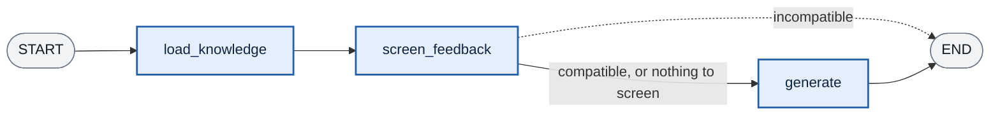

# The OptimizerAgent, from the inside

The OptimizerAgent generates the artifact the user picked at the `post_audit` gate — `llms.txt`, `robots.txt`, `meta-tags.html`, `structured-data.jsonld` or `mcp.json` — from the validated `SiteProfile`, the worker findings, and whatever feedback the current pass carries. It is a subagent, not a node: `run()` returns domain data, and the `invoke_optimizer` supervisor node decides how to write it to `LLMLensState`.

Source: [`src/agents/subagents/optimizer_agent/`](../src/agents/subagents/optimizer_agent/).

---

## 1. Two families of artifacts

Everything about the agent follows from one split: **half the artifacts are written by a model, half are assembled by a pure function.** A single `artifact_key` per run selects which family handles it.

| | LLM-driven | Deterministic |
|---|---|---|
| **Artifacts** | `llms_txt`, `meta_tags`, `structured_data` | `robots_txt`, `webmcp` (manifest) |
| **Registered in** | `SUPPORTED_NON_DETERMINISTIC_ARTIFACTS` (key → output schema) | `DETERMINISTIC_ARTIFACTS_GENERATORS` (key → generator function) |
| **Who writes the bytes** | An LLM call against a hub prompt + a `SiteProfile` | A pure function over the audit findings |
| **Skill document** | Loaded from LangSmith Hub | None — the spec is the generator |
| **Feedback applied by** | Re-generating with the feedback in the prompt | A structured *override* the generator then applies (section 5) |
| **Validation** | Graded by the ValidatorAgent | Placeholder pass — there is no model output to grade |

The deterministic family exists because of what those files must keep matching: a `robots.txt` is a union over crawler findings, and an `mcp.json` must name the tools the page registers at runtime. Letting a model rewrite either is where a directive quietly goes missing — a `robots.txt` with a crawler dropped is still a perfectly valid file, so nothing downstream would see it.

---

## 2. What goes in, and what comes back

`run()` takes the site profile, the artifact key, the findings the deterministic generators need, and **two separate feedback slots**. It returns a triple:

```python
(generated_artifacts, refinement_status, feedback_screening)
```

| Return | What it carries |
|---|---|
| `generated_artifacts` | `{artifact_key: content}` — **empty when screening refused the request** (nothing was regenerated, so the version the caller already holds still stands) |
| `refinement_status` | `NOT_NEEDED` / `REFINED` / `FAILED_FEEDBACK` — only meaningful for the deterministic family; it is how "your change could not be applied, the previous version stands" reaches the user |
| `feedback_screening` | The screening verdict, including the user-facing `reason` the supervisor shows when it refuses |

The two input feedback slots stay separate on purpose:

- **`user_feedback`** — the change the user asked for. It survives its own regeneration: when the validator later sends the artifact back for repair, the instruction still applies.
- **`validation_feedback`** — regeneration instructions built from the validator's ERROR findings. One slot shared between them would let an automatic repair pass overwrite what the user asked for. They are merged only at the last moment, inside the prompt's `feedback_block` (section 4).

---

## 3. The three nodes



> **Legend**
> - 🟦 a node of the OptimizerAgent's own compiled graph
> - ⇢ dotted is the early exit — the reason the graph routes back to the user instead of onward

### `load_knowledge`

Pulls the artifact's skill document (`llm-lens-skill-<artifact_key>`) from LangSmith Hub and caches it per key, so a regeneration in the same session does not re-fetch. Deterministic artifacts skip it — they have no skill document, the generator *is* the spec.

### `screen_feedback`

Runs only when there is `user_feedback` *and* a loaded spec to check it against — the deterministic generators have no skill document, so there is nothing to screen. One structured-output call returns `FeedbackScreening`:

```python
class FeedbackScreening(BaseModel):
    compatible: bool          # False only when the request necessarily breaks a stated rule
    violated_rule: str | None # the rule, quoted
    reason: str               # one sentence addressed to the user, shown verbatim
```

It is **deliberately permissive** — it rejects only on a rule it can quote. The cost of a false rejection is refusing something the user is entitled to ask for, which is worse than generating a version the ValidatorAgent then catches. It is also not a safety gate: a request that looks innocuous can still produce a spec violation, and that is what the deterministic checks downstream are for.

Screening runs *before* generating, so a request that cannot be honoured costs nothing but the screening call. When it refuses, the supervisor's router reads `INPUT_ERROR` and sends the user back to rephrase — routing onward to the validator instead would grade the *previous* version again and report it as fine.

### `generate`

Dispatches on the artifact key and normalizes the one defect structured output always introduces: the artifact arrives as a JSON string field, and the trailing newline every text file should end with does not survive that trip. It is re-added where the artifact is produced rather than where it is written to disk, because the same string goes to the PR node, the frontend, and the validator — which grades it in memory before any of them see it.

---

## 4. The LLM-driven path

`llms_txt`, `meta_tags` and `structured_data` share one code path: resolve the hub prompt, bind the artifact's output schema (`LlmsTxtArtifact` / `MetaTagsArtifact` / `StructuredDataArtifact` — all a single `content` field), build the template variables, invoke.

`_build_template_vars` is where per-artifact state routing lives. All three are `SITE_PROFILE_DRIVEN_ARTIFACTS`, so the common block — `url`, `knowledge`, `existing_artifact_block`, `feedback_block` — is extended with the profile's fields verbatim: `purpose`, `audience`, `main_sections`, `tone`, `tech_signals`, `confidence`.

Two rendered blocks deserve their own paragraph:

- **`existing_artifact_block`** — the file the site serves today, fenced and introduced as *reference material*, not a draft. Handed an existing file and asked for a better one, a model tends to return a lightly edited copy — inheriting the very problems the artifact is meant to fix. So it is framed as a source of facts the model cannot derive (URLs, identifiers, names), capped at 8000 chars.
- **`feedback_block`** — where the two feedback slots finally meet. The validator's text arrives already written as instructions and passes through untouched; the user's gets a header; and only when *both* are live is a precedence note appended: *the user's instruction wins* — the validator enforces a house style, the user is the one who has to live with the file.

---

## 5. The deterministic path: feedback without a rewrite

`robots_txt` and `webmcp` are assembled by pure functions — `generate_robots_txt(robots_txt_finding)` and `generate_webmcp_manifest(annotations, site_profile, url)`. With no user feedback, that is the whole run.

With feedback, the model only **reads**. It turns the request into a structured *override*, and the same generator that produced the file applies it — so what cannot be expressed as an override is refused out loud rather than half-applied:

| Artifact | Override schema | Editable surface | Everything else |
|---|---|---|---|
| `robots.txt` | `RobotsTxtOverride` | `crawlers` to allow (each resolved against `KNOWN_AI_BOTS` + `KNOWN_NON_AI_CRAWLERS`, or the model's own `recognized` flag — either list alone goes stale) | blocking a crawler, crawl-delay, path rules → `unsupported_request` |
| `mcp.json` | `WebMcpOverride` | manifest description, per-tool description rewrites, tool omissions — each resolved against the page's annotated forms | adding or renaming a tool, touching its schema → `unsupported_request` |

The editable surface is exactly what the file can change without breaking its contract: the manifest's tool names and input schemas must keep matching what the page registers, so prose and omission are all a safe edit can touch.

When nothing in the request can be applied — an unsupported ask, or every named crawler unresolvable — `keep_previous_version` returns the deterministic base with `FAILED_FEEDBACK`, which the supervisor turns into a "kept the previous version, try rephrasing" notice instead of a file that looks like it honoured the request.

---

## 6. The statuses the caller reads

`RefinementStatus` is the channel that lets a deterministic artifact say *how* a feedback pass ended, since its content alone cannot:

| Status | Meaning |
|---|---|
| `NOT_NEEDED` | First pass, or any LLM-driven artifact — there was no deterministic base to refine |
| `REFINED` | The override was applied; the generator re-ran with it |
| `FAILED_FEEDBACK` | Nothing in the request could be applied; the previous version stands |

Combined with `feedback_screening`, the supervisor can distinguish three different "no" outcomes — a request refused before generating (screening), a request that generated but could not be applied (refinement), and the absence of both (success).
