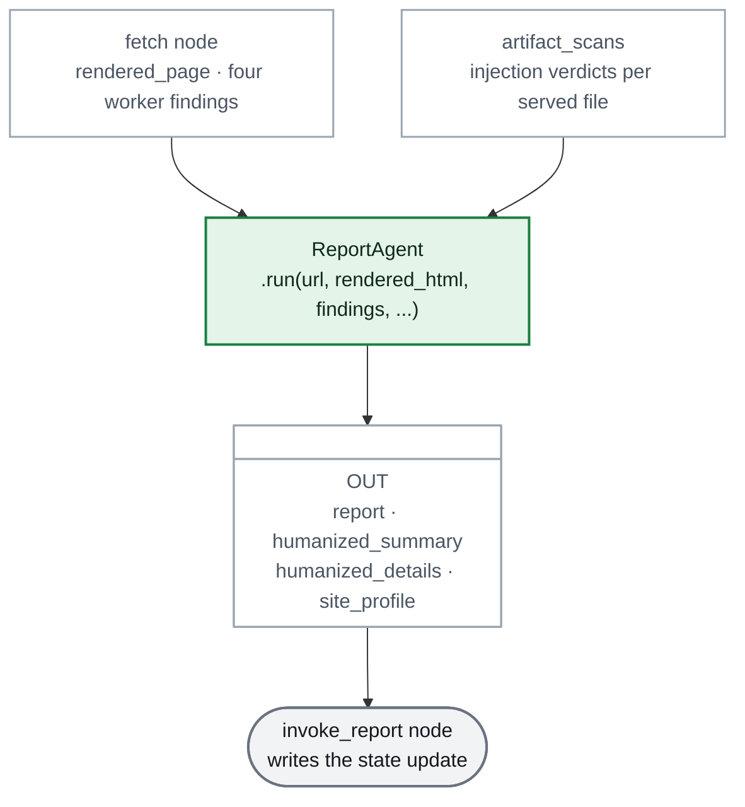
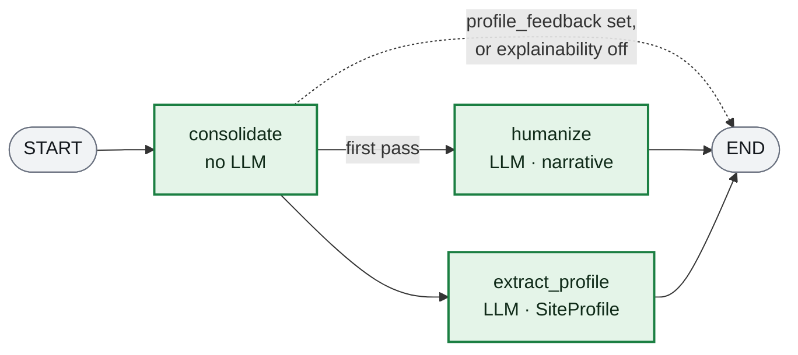

# The ReportAgent, from the inside

The ReportAgent turns raw worker findings into the three things the rest of the session runs on: the structured `AuditReport`, the narrative the user reads (`humanized_summary` + `humanized_details`), and the `SiteProfile` every artifact is generated from. It is a subagent, not a node — the `invoke_report` supervisor node calls `run()` and writes the result to `LLMLensState` itself.

Source: [`src/agents/subagents/report_agent/`](../src/agents/subagents/report_agent/).

---

## 1. What goes in, and what comes back

`run()` takes the fetch node's entire harvest — the rendered page plus the four worker findings — and returns a dict the calling node merges into the state:

> **Legend**
> - 🟩 the **ReportAgent** itself
> - ⬜ the supervisor node that owns the state write
> - white boxes are data: what `run()` receives, what it returns

Two inputs are worth singling out:

- **`artifact_scans`** is computed by the fetch node, not here. The verdict is needed in two places — the report's hostile/suspicious lists and the ChatAgent's rendering — so the scan happens once upstream and the ReportAgent reads the result rather than re-scanning the same bytes.
- **`profile_feedback`** is what makes a run a *re-run*. Set by the supervisor when the ValidatorAgent rejected the previous `SiteProfile`, it changes which nodes fire — see section 3.

| Output | What it is | Main consumer |
|---|---|---|
| `report` | `AuditReport`: five classified artifact lists plus a one-line summary | the `post_audit` menu, the ChatAgent |
| `humanized_summary` | One executive paragraph over the whole audit | the report header, the ChatAgent, the PR body |
| `humanized_details` | One paragraph per dimension (discoverability, seo, webmcp, geo) | the ChatAgent's per-dimension memory |
| `site_profile` | The agent's understanding of what the site is | the ValidatorAgent (graded against the page), the OptimizerAgent (source of truth for generation) |

---

## 2. The three nodes

> **Legend**
> - 🟩 a node of the ReportAgent's own compiled graph
> - ➡️ solid is the unconditional edge · ⇢ dotted is the skip

`consolidate` runs first because both model calls build on its `report`. The two model calls then fan out in parallel — `humanize` does not need the profile and `extract_profile` does not need the narrative.

The conditional edge is the interesting part: a validator-driven re-run (`profile_feedback` set) **skips `humanize` entirely**. The narrative was written from findings that have not changed — only the profile was rejected — so re-humanizing would spend an LLM call to produce the same text. The `explainability` flag can turn it off too, for runs that only want the machine-readable half.

---

## 3. `consolidate`: the audit verdict, no model involved

Pure logic. It walks a fixed map of the five audited artifacts and sorts each into one list by its `SignalStatus`:

|| List | Meaning |
|---|---|---|
|| `missing_artifacts` | no finding, or `MISSING` |
|| `present_artifacts` | `PRESENT` |
|| `broken_artifacts` | `ERROR` — a file was found but could not be read |
|| `hostile_artifacts` | the injection scan found content written to instruct AI readers |
|| `suspicious_artifacts` | content that addresses AI readers or hides characters |

The second axis comes from `artifact_scans` rather than the workers: `present` says *the file is there*, `hostile`/`suspicious` say *what is in it*. Both enums spell the artifacts identically, so the scan results convert by value.

The lists fold into a one-line `summary` — and the ordering is deliberate: the hostile line goes **first**, because it is the only line about someone attacking the user's visitors rather than about the user's own housekeeping.

---

## 4. `humanize`: the narrative, written under a budget

One structured-output call producing `HumanizedReport` — a `summary` paragraph plus a `details` paragraph per dimension.

The noteworthy work happens *before* the call. The findings blob is attacker-adjacent content (it quotes the site's own files) and Groq rejects an over-budget request outright rather than queueing it, so the blob is compacted and fenced:

- **Per-field caps** (`_TEXT_BUDGET` = 300 chars, `_LIST_BUDGET` = 15 items) trim rather than drop — a truncated value says how much was left out, so a long `llms.txt` is described as long instead of an excerpt being described as the whole thing.
- **`_DROPPED_FIELDS`** removes what the model never reasons over: `raw_content` (kept for the UI's side-by-side view) and `all_bot_directives` (a union of two fields already in the blob).
- **A last-resort cap** (`_FINDINGS_BUDGET` = 20 000 chars, ~5k tokens) cuts the serialized JSON if the per-field bounds were not enough — a narrative from most of the findings beats a 413 and no narrative.
- **`fence()`** wraps the blob so any text in it that reads like an instruction is marked as audited content, not direction.

`verbosity` is injected as a prompt fragment (`_verbosity_instructions`), so `brief` compresses the narrative without changing the pipeline.

---

## 5. `extract_profile`: the SiteProfile

One structured-output call bound to the `SiteProfile` schema: `purpose`, `audience`, `main_sections`, `tech_signals`, `tone`, `confidence`.

The model does not see the raw page. `_clean_html_for_profile` strips scripts, styles, SVGs, comments, `srcset` and the noisier attributes, keeps tags/text/hrefs/alt/title, then caps the result at `_PROFILE_HTML_BUDGET` (10 000 chars). What is removed is exactly what carries no signal for *what the site is* — and the cleaning means a heavy page costs a light prompt.

Two edge cases are handled in code rather than left to the model:

- **No rendered HTML** → a low-confidence placeholder profile, so downstream code can rely on the field existing.
- **`profile_feedback` set** → the validator's instructions are embedded verbatim via `_profile_feedback_instructions`, with a directive to change only what was called out. The feedback arrives already written as instructions; rephrasing it here would let the regeneration drift away from the checks that actually failed.

`confidence` is not decoration: it is what the ValidatorAgent's own checks read to decide whether a sparse page may claim `high`, and it travels into the generation prompts so the OptimizerAgent knows how much to trust the profile.

---

## 6. The repair loop, seen from inside

The supervisor calls `run()` a second time when `validate_profile` returns feedback, capped at `MAX_PROFILE_REGENERATIONS = 1`. From the agent's side the difference is exactly two things:

1. `humanize` is skipped (section 2).
2. `extract_profile` gets the failed checks as an instruction block (section 5).

Everything else — the input, the graph, the output shape — is identical to a first pass. The loop is one-shot because the repair regenerates from an identical page and findings: whatever survived the first correction is unlikely to fall to a third, so the remaining findings are surfaced and the session moves on to the `post_audit` gate.
