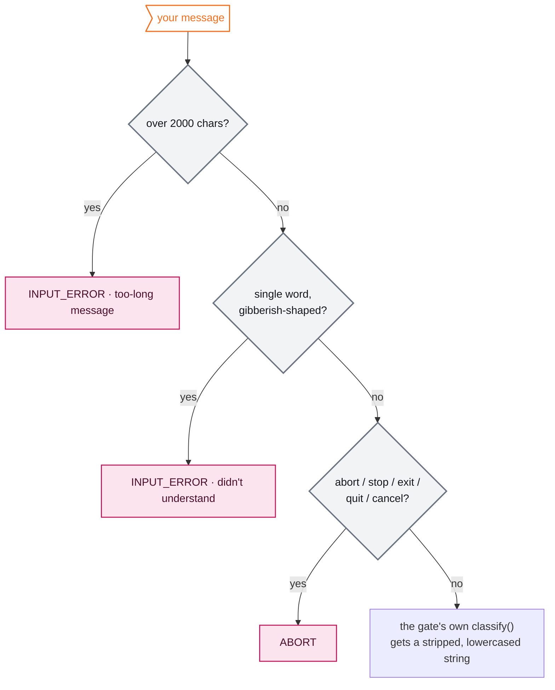

# The supervisor, gate by gate

How [`LLMLensAgent`](../src/agents/llm_lens_agent.py) decides what a user's turn *is*, and where it sends the session next. This is the companion to [architecture.md](./architecture.md) — that document draws the map; this one is the routing table for every gate on it.

Two halves, and they are different machines:

1. **`classify(user_msg, state)`** — inside each gate, maps the raw text you typed onto one `Actions` value (or an `INPUT_ERROR` with a ready-made reply).
2. **The router** — a conditional edge after each gate that reads only `state["last_taken_action"]` and picks the next node. It never re-reads your text; everything it needs was decided inside the gate.

A gate is a node, so it both classifies *and* writes: `messages`, `last_taken_action`, plus gate-specific keys (`url`, `selected_artifact`, `user_feedback`, `github_url`).

---

## 1. What every gate does before it does anything

All five gates share `BaseGate.classify`, which runs three fast paths on the raw input before gate-specific logic ever sees it. Each one short-circuits — a `UserIntent` returned is final, a string means "keep going":

- **The 2000-char cap** is measured on the raw input, before stripping — what costs tokens is what was sent, not what survives cleaning.
- **Gibberish** is deliberately narrow: single word, 4+ chars, no vowels or letters+digits mixed. Anything with a `.` or `/` is exempt — domains are single "words" too, and `site123.com` must never read as noise.
- **The abort words** work identically at every gate. The session has no other universal escape hatch.

When a gate does answer a question (`ANSWER_QUESTION`), two session-wide limits apply via `_answer_question`: `MAX_CHAT_TURNS = 25` counted globally — it is the same loop wherever you are standing — and the question/reply pair is wrapped with `ContextWindow.question/answer` marks so the rolling summary can pick real exchanges out of a log full of menu picks (see [chat-agent.md](./chat-agent.md) §7).

---

## 2. `initial` — the only gate with a model

The only place in the whole graph where a model picks an action; every other gate decides in code. Which is also why `ALLOWED_ACTIONS` only needs enforcing here — `_vet_llm_action` refuses an out-of-menu verdict and turns it into `INPUT_ERROR`.

| You typed | `classify()` returns | Router sends you to |
|---|---|---|
| a URL (with or without `https://`) | `ADVANCE` + `extracted_url`, **after** a 3-second HEAD reachability probe | `fetch` |
| a URL that fails the probe | `FETCH_ERROR` + a check-the-URL message | back to `initial` |
| "the url", "link", "it" — referencing one without pasting it | `INPUT_ERROR` + "you forgot to paste it" | back to `initial` |
| anything else | the **LLM intent classifier** (`llm-lens-supervisor-intent-classifier`), constrained to `ADVANCE / ANSWER_QUESTION / INPUT_ERROR / ABORT` | per the verdict: `fetch`, back to `initial`, or END |
| abort word | `ABORT` | END — the session stops before anything ran |

The URL extractor is a fast path, not the classifier: first token-shaped thing that parses as `http(s)://host`, else `domain.tld` auto-prefixed — with `robots.txt`, `llms.txt`, `readme.md` explicitly excluded so mentioning a filename is not mistaken for a domain.

**Why the model exists here at all:** "audit this site" has no URL and no menu answer, and yet it is the most natural thing to say. The classifier's real job is telling *a question* apart from *an instruction to proceed* — everything mechanical was already settled above it.

---

## 3. `post_audit` — the menu with three kinds of "no"

Numbered menu, `"0"` walks away. The options and their blocking rules live in [`post_audit_menu.py`](../src/agents/gates/post_audit_menu.py) — one module read by three consumers that must never disagree: the gate that enforces it, the UI that greys it out, and the ChatAgent that explains it.

| You typed | `classify()` returns | Router sends you to |
|---|---|---|
| `0` | `ABORT` | END |
| `1`–`5`, an available artifact | `ADVANCE` + `selected_artifact` | `invoke_optimizer` |
| `1`–`5`, already generated this run | `ALREADY_GENERATED` | back to `post_audit` |
| `2`, but your robots.txt already grants every AI crawler | `ALREADY_OPTIMAL` | back to `post_audit` |
| `5`, but the served manifest already covers (or exceeds) the page's tools | `ALREADY_OPTIMAL` | back to `post_audit` |
| `5`, but the page has no `toolname`-annotated forms | `PREREQUISITE_MISSING` | back to `post_audit` |
| `6` (WebMCP annotations) | `COMING_SOON` | back to `post_audit` |
| anything else | `ANSWER_QUESTION` | back to `post_audit`, via the ChatAgent |
| abort word | `ABORT` | END |

Two details of the ordering:

- **`ALREADY_OPTIMAL` is checked before `PREREQUISITE_MISSING`** for `webmcp`: a site can serve a complete manifest and annotate nothing, and "you have no annotations" is the wrong reason to give someone whose manifest is already fine.
- **`ALREADY_OPTIMAL` exists because the generators are honest.** `robots.txt` assembled from findings on a site that already allows every AI bot is a file that says the same thing in more lines — the gate says so rather than opening a PR that changes nothing but the line count. The WebMCP case is stronger: our manifest could only *drop* tools the audit cannot see, so the message says "mine would be smaller than yours" instead of offering it.

The menu checks run on **state, not text**: whether an artifact exists in `generated_artifacts`, what the findings say. The LLM is not consulted — there is nothing ambiguous left by the time a numeric pick is ruled out, and free text is a question by definition.

---

## 4. `post_validation` — approve, tweak, or ask

Reached only after the validator passed (or hit its one-shot cap). Options: `1` reoptimize, `2` continue/approve.

| You typed | `classify()` returns | Router sends you to |
|---|---|---|
| `1` | `REOPTIMIZE` — **but** the gate enforces `MAX_USER_REOPTIMIZATIONS = 1` per artifact; past the cap it quietly rewrites the action to `ADVANCE` | `reoptimize_feedback`, or back to `post_audit` when the allowance is spent |
| `2` | `ADVANCE` — "approved" | back to `post_audit` to pick the next artifact |
| anything else | `ANSWER_QUESTION` | back to `post_validation`, via the ChatAgent |
| abort word | `ABORT` | END |

> **Wired but unreachable.** The router still carries a `GO_TO_EXPORT → export` edge and the gate still lists it in `ALLOWED_ACTIONS`, but `classify()` as written never produces that action — typing "export" is just a question. In the current flow the session ends either by approval-then-`0`, or by `ABORT`; the export gate is dead code waiting for a menu option that emits `GO_TO_EXPORT`.

The reoptimization cap lives in the gate's `__call__`, not in `classify`: the count is incremented at `reoptimize_feedback` (the feedback was *collected*), so a refused screening can refund it — see below.

**`reoptimize_feedback` is reached two ways**, and the reason differs (architecture.md, "A session, end to end"): from `post_validation` you chose to tweak a passing artifact; from `invoke_optimizer` your request was refused by screening and nothing was regenerated. Same gate, same next step — back to `invoke_optimizer`.

---

## 5. `reoptimize_feedback` — the one gate that takes everything

The simplest classifier in the system: **any real text is valid feedback.**

| You typed | `classify()` returns | Router sends you to |
|---|---|---|
| anything that survived the shared fast paths | `ADVANCE` — and `__call__` writes `user_feedback[selected_artifact] = your text` and increments `user_reoptimization_count` | `invoke_optimizer` |
| over-length / gibberish | `INPUT_ERROR` | back to `reoptimize_feedback` |
| abort word | `ABORT` | END |

No questions answered here — a "question" about the artifact *is* feedback to feed the next pass, and asking would only spend a chat turn on the way to the same place.

**The refund.** When the optimizer's screening refuses the request, `invoke_optimizer` rolls back both of this gate's effects: `user_feedback[artifact]` is removed (it would otherwise be re-screened or merged into the next attempt) and `user_reoptimization_count` is decremented (a request we never acted on should not spend the user's one allowance). `applied_user_feedback` is cleared so the validator doesn't grade a change that never happened.

---

## 6. `export` — GitHub or goodbye

Wired from `post_validation` — you export after approving something, not instead of generating it — but see the note in section 4: nothing currently emits `GO_TO_EXPORT`, so this gate is only reachable in a resumed thread or a direct graph call. When it does run:

| You typed | `classify()` returns | Router sends you to |
|---|---|---|
| a `github.com/owner/repo` URL | `ADVANCE` + `github_url` | `pr` |
| a URL that isn't GitHub (GitLab, Bitbucket, self-hosted) | `INPUT_ERROR` + a name-the-host message | back to `export` — better than letting the PR node fail on a parse the user reads as "bad link" |
| `no`, `nope`, `skip`, `not now`, … (`DECLINE_INPUTS`) | `ABORT` | END — "export declined" |
| anything else | `ANSWER_QUESTION` | back to `export`, via the ChatAgent |
| abort word | `ABORT` | END |

The `pr` node re-checks `is_github_url` anyway — a resumed thread or a direct graph call can land a non-GitHub URL there without passing the gate.

---

## 7. The two loops that bypass the gates

Not every routing decision is a user turn. Two conditional edges route on **feedback presence**, not on `last_taken_action`:

| After | Reads | Loops back to | Cap | On cap |
|---|---|---|---|---|
| `validate_profile` | `site_profile_feedback` | `invoke_report` | `MAX_PROFILE_REGENERATIONS = 1` | findings are surfaced, on to `post_audit` |
| `invoke_validator` | `validation_feedback` | `invoke_optimizer` | `MAX_ARTIFACT_REGENERATIONS = 1` per artifact | findings are surfaced, on to `post_validation` |

Both are one-shot because the repair pass regenerates from identical inputs — whatever survived the first correction is unlikely to fall to a third. The feedback key is **cleared when consumed** (`site_profile_feedback` by `invoke_report`, `validation_feedback` by `invoke_optimizer`), because the router cannot tell a stale rejection from a fresh one.

And one edge routes on a screening outcome: `invoke_optimizer` → `reoptimize_feedback` when `last_taken_action` came back `INPUT_ERROR`, because routing on to the validator would grade the *previous* version and report it as fine.

---

## 8. The whole thing as a lookup table

| Gate | Sole job of `classify` | Uses an LLM? | Its ADVANCE goes to |
|---|---|---|---|
| `initial` | find a URL / spot a question | yes — intent classifier | `fetch` |
| `post_audit` | map a menu pick, with availability from state | no | `invoke_optimizer` |
| `post_validation` | approve vs reoptimize vs ask | no | `post_audit` (approved) · `reoptimize_feedback` · `export` (wired, unemitted) |
| `reoptimize_feedback` | everything is feedback | no | `invoke_optimizer` |
| `export` | GitHub URL vs decline vs ask | no | `pr` |

The pattern to notice: **classification gets cheaper the deeper the session gets.** At `initial` a model is warranted — the input space is unbounded and the wrong call costs an audit. By `post_validation` the honest options fit on two fingers, and by `reoptimize_feedback` there is nothing left to classify at all. The model's authority shrinks exactly as the cost of guessing wrong shrinks — which is the supervisor-agent trade from architecture.md applied to the gates themselves.
