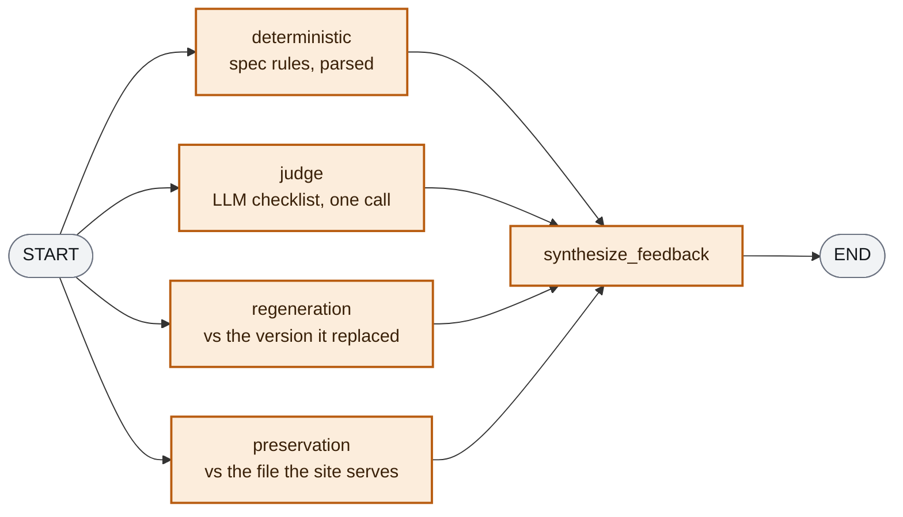

# The ValidatorAgent, from the inside

The ValidatorAgent is the quality gate. It grades whatever the ReportAgent or OptimizerAgent just produced — a `SiteProfile`, or one of the three LLM-driven artifacts — and returns a verdict the supervisor turns into either a pass or a repair instruction. It is a subagent, not a node: `run()` returns a `ValidationReport`, and the calling node writes it to `LLMLensState`.

Source: [`src/agents/subagents/validator_agent/`](../src/agents/subagents/validator_agent/).

The same checks back the eval suite — written once, run in two places. In evals they assert against a fixed dataset to catch prompt regressions; here they run on live output and generate feedback.

---

## 1. What goes in, and what comes back

`run()` is called twice per session in two different shapes: once over the extracted `SiteProfile` (target `site_profile`, run by `validate_profile`), and once per generated artifact (targets `llms_txt`, `meta_tags`, `structured_data`, run by `invoke_validator`).

| Input | Role |
|---|---|
| `target` | Which `ValidationSpec` applies — and which of the four check nodes have anything to say |
| `content` | The artifact text. `None` when grading the `SiteProfile` |
| `site_profile` | The source of truth the artifact was generated *from* — the judge grades against this, never against the page (that would re-litigate the ReportAgent's work in the wrong place, producing findings the optimizer cannot act on) |
| `rendered_html` | Only consulted for the `SiteProfile` target, where the page *is* the ground truth |
| `user_feedback` | The change the user asked for on this pass — `None` on a validator-driven repair, which is what tells the regeneration checks to stay quiet |
| `previous_content` | The version this one replaced. Paired with `user_feedback`: one says what was asked, the other is what the answer is diffed against |
| `existing_artifact` | The file the site already serves — the only baseline that exists on a first generation |

The output is a `ValidationReport`: the flat `checks` list, a `feedback` string built from the failures, and a `passed` property — true when no **ERROR**-severity check failed. WARNINGs never block.

`robots_txt` and `webmcp` are absent from the target list on purpose: they are assembled deterministically, so there is no model output to grade, and the supervisor hands them a placeholder pass instead.

---

## 2. The ValidationSpec: one contract per target

Each target registers a `ValidationSpec`, which is the entire per-target surface — the nodes themselves are generic:

```python
@dataclass(frozen=True)
class ValidationSpec:
    run_deterministic: Callable[[ValidatorState], list[CheckResult]]
    verdict_model: type[BaseModel]                 # the judge's structured checklist
    build_judge_messages: Callable[[ValidatorState], JudgePrompt]
    judge_severities: dict[str, Severity]          # ERROR by default
    build_diff: Callable[[str, str], ArtifactDiff] | None
    in_artifact_scope: Callable[[str], bool] | None
```

| Spec | Deterministic checks | Judge criteria | `build_diff` | `in_artifact_scope` |
|---|---|---|---|---|
| `site_profile` | D1–D5 (sentence shape, sections in markup, cap on sections, confidence floor, not-the-fallback) | 7: grounding × fields, specificity × purpose/audience | ✗ — never regenerated from user feedback | — |
| `llms_txt` | D1–D16 + injection check | 6: grounding, specificity, utility | sections, bullets, links, blockquote | excludes defects the generation is *meant* to drop (code fences, malformed bullets) |
| `meta_tags` | D1–D20 + injection check | 7, incl. `grounding_inferred_name` — the invented-author failure mode | tag-by-tag | only what the template can emit — the baseline is the whole `<head>`, so without it the check would demand preserving a `charset` the generator was never asked to write |
| `structured_data` | D1–D17 + injection check | 4 — JSON-LD has two free-text fields; everything else is structure, settled by parsers | entity properties | — |

Two contract details carry most of the design:

- **`judge_severities`** is the per-criterion escape hatch from ERROR. The only override in the codebase is `specificity_audience` → WARNING on the SiteProfile: a portfolio's audience genuinely *is* an archetype, so the check fires on profiles that are actually correct. Worth surfacing, not worth a regeneration.
- **`build_diff` = None** is how the `SiteProfile` opts out of the regeneration node — the only loop it participates in is the validator's own.

The judge questions live in hub prompts (`llm-lens-validator-*-judge`), not in the check modules — the wording of a binary check *is* the check, so it is versioned like any other prompt.

---

## 3. The four check nodes, and when each stays quiet



> **Legend**
> - 🟧 a node of the ValidatorAgent's own compiled graph; `synthesize_feedback` is the join that waits for all four

The four fan out unconditionally from START — the conditions are about *state*, so they live inside the nodes rather than as four more edges to maintain:

| Node | Answers | Quiet when |
|---|---|---|
| `deterministic` | Is this the file the spec asked for? Parsers only, no model. | never |
| `judge` | The spec's binary checklist, in one call — cost is per call, not per boolean, and the judge sees the target whole. Structured output pins the criteria to `verdict_model`, so it cannot invent, rename or skip one. | the judge never answers — a retryable/unavailable failure degrades to a WARNING check (`*_judge_unavailable`), not a crash and not a pass |
| `regeneration` | Did the pass do what the user asked — and *only* that? | no `build_diff`, no `user_feedback`, or no `previous_content` — first passes, validator repairs and the SiteProfile all land here and all leave without a finding |
| `preservation` | Did this version silently drop what the site already declared? | no `build_diff`, or the site serves no version of this artifact |

The split between `regeneration` and `preservation` is the part worth understanding, because they grade different baselines:

- **`regeneration`** compares `previous_content` → `content`: two versions *this pipeline* produced, and only exists under user feedback. It diffs in the artifact's own semantic units (section, link, tag, entity property — `checks/diff.py`), then asks the judge two questions over the change set: `applied_requested_change` and `no_unrequested_changes`. Both are ERROR — the second one earns it: a regeneration that honours the request and rewrites three other things on the way is the failure that actually shows up, because the optimizer works under a long prompt with instructions competing for attention. An *empty* diff is caught for free, without the model: the artifact handed back unchanged is the loudest form of "the feedback was not applied".
- **`preservation`** compares `existing_artifact` → `content`: the served file against our generation, and it fires on *first* passes — the pass where the damage happened. Handed a site with an exemplary `llms.txt`, the optimizer once wrote a fresh one from the profile and dropped the documentation sets that were the file's whole point; every check passed, because every check asked whether the new file was well-formed, not whether it was worse than the old one. Deterministic, no judge: "which named unit is in the old file and not in the new one" is a set comparison. Losing something is a finding, not a veto — the feedback says *carry each one over unless the audit flagged it*.

Only the judged half of `regeneration` costs a model call, and only when something actually changed. The node never sees the previous version as text — the diff omits every unit that did not move, so the model cannot rebuild a different change set and grade that instead.

---

## 4. Severity: what is allowed to loop

Every `CheckResult` is `{name, passed, severity, error}`, and the severity decides whether a failure becomes feedback:

| Severity | Meaning | Examples |
|---|---|---|
| `ERROR` | The producing agent can plausibly fix this by rewriting | malformed bullets, a dropped served section, an unapplied request |
| `WARNING` | Reported so it stays visible, but never fed back | known pipeline limits (sparse HTML, missing upstream data) that regenerating cannot fix — and house-style conventions where the rewrite would cost more than the deviation |

Only ERROR failures reach `feedback`. A warning about something regeneration cannot fix would otherwise loop to the cap every single time — that is the whole reason the severity axis exists.

---

## 5. `synthesize_feedback`: the verdict, assembled deterministically

The join node merges all four check lists into the report and turns actionable failures into instructions:

```
A validation pass found the following problems with the previous version.
Fix every one of them and change nothing else:
- <check.error verbatim, one per line>
```

Assembled in code rather than with another LLM call: the check errors are already written as readable one-liners, and a summarizing model here would be one more place for the feedback to drift away from what actually failed.

One collision is deliberately *logged rather than handled*: spec findings ("the artifact violates the spec") and regeneration findings ("it did not do what the user asked") can both be true in one report, and emitting both asks the optimizer for two things that may not both hold. No precedence rule is applied — the loop cap bounds the blast radius and the optimizer's screening filters outright-invalid requests, so the warning fires with examples attached and the rule gets written against real cases if the collision ever happens at all.

When nothing actionable failed, `feedback` is `None` — which is what the supervisor's router reads as "pass, advance to the gate".
